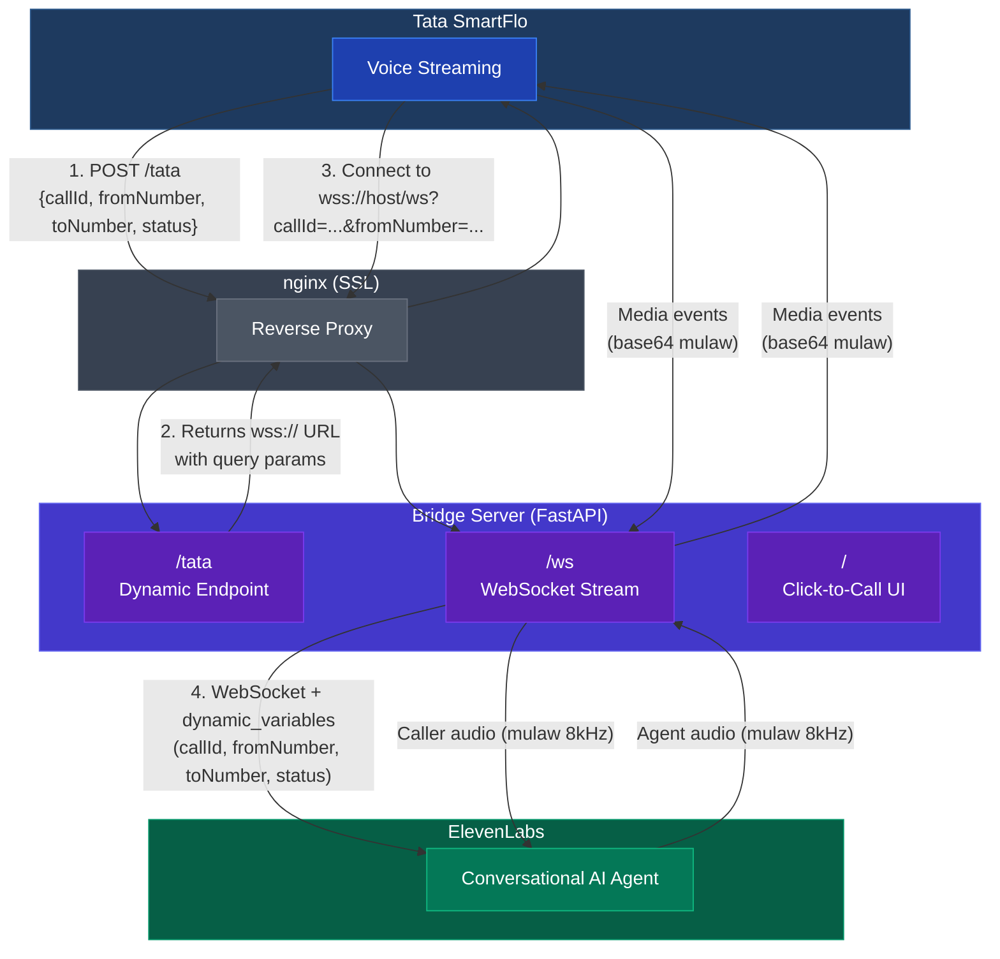
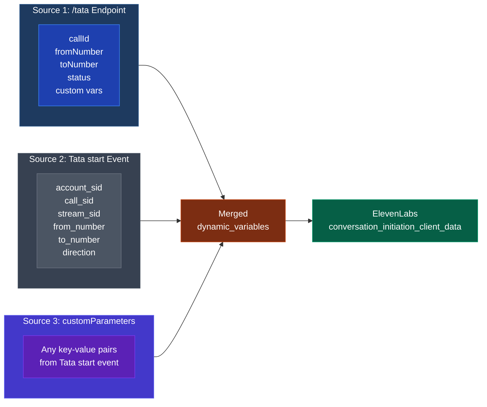

# Tata Telephony to ElevenLabs WebSocket Bridge

A WebSocket bridge that connects Tata SmartFlo voice streams to ElevenLabs Conversational AI agents. Supports both static and dynamic WebSocket endpoints, click-to-call UI, and custom parameter passthrough.

Audio is G.711 mulaw at 8000 Hz in both directions. No conversion is needed.

## Architecture



### Call Flow

1. A call is initiated (via click-to-call UI or Tata SmartFlo)
2. Tata hits `POST /tata` with call metadata (callId, fromNumber, toNumber, status, custom vars)
3. The bridge returns a `wss://` URL with all variables encoded as query parameters
4. Tata connects to that WebSocket and starts streaming audio
5. On the `start` event, the bridge opens a WebSocket to ElevenLabs and sends all collected variables as `dynamic_variables` in `conversation_initiation_client_data`
6. Audio flows bidirectionally between Tata caller, Bridge, and ElevenLabs agent

### Dynamic Variables Data Flow

Variables are collected from three sources and merged before being sent to ElevenLabs:



If keys overlap, later sources override earlier ones.

## Files

| File | Purpose |
|---|---|
| `server.py` | FastAPI app, WebSocket bridge, dynamic endpoint, click-to-call UI |
| `audio_converter.py` | Audio output buffer for chunked delivery |
| `requirements.txt` | Python dependencies |
| `.env.example` | Template for environment variables |

## Requirements

- Python 3.9 or later
- An ElevenLabs Conversational AI agent configured with `ulaw_8000` audio format
- A Tata SmartFlo account with Voice Streaming enabled

## Local Setup

```bash
python3 -m venv venv
source venv/bin/activate
pip install -r requirements.txt

cp .env.example .env
# Edit .env with your credentials
```

Start the server:

```bash
python server.py
```

The server runs on `http://0.0.0.0:8000` by default.

## Environment Variables

| Variable | Required | Description |
|---|---|---|
| `ELEVENLABS_AGENT_ID` | Yes | ElevenLabs agent ID for routing calls |
| `ELEVENLABS_WS_URL` | No | ElevenLabs WebSocket URL (default: global endpoint, set for EU/US/India residency) |
| `TATA_CTC_API_KEY` | For click-to-call | Tata SmartFlo API key |
| `TATA_CALLER_ID` | For click-to-call | DID number registered in your Tata account |
| `TATA_CTC_URL` | No | Tata click-to-call API URL |
| `WSS_PUBLIC_HOST` | For dynamic endpoint | Public hostname for the WSS URL returned by `/tata` |
| `HOST` | No | Bind host, default `0.0.0.0` |
| `PORT` | No | Bind port, default `8000` |

The agent ID can also be passed per-connection as a query parameter:

```
wss://your-server/ws?agent_id=your_agent_id
```

## Endpoints

| Path | Method | Description |
|---|---|---|
| `/` | GET | Click-to-call UI with live payload preview |
| `/tata` | POST/GET | Dynamic voice endpoint. Returns `{"sucess": true, "wss_url": "wss://..."}` |
| `/ws` | WebSocket | Main endpoint for Tata voice streaming |
| `/api/click-to-call` | POST | JSON API to initiate calls via Tata SmartFlo |
| `/health` | GET | Liveness probe |

## Dynamic Endpoint

Configure this in Tata SmartFlo under Settings > Channels > Voice Bot as a **Dynamic** endpoint.

**Setup:**
- Endpoint type: Dynamic
- Method: POST
- URL: `https://your-server/tata`

**Body variables to map:**

| Key | Value |
|---|---|
| `callId` | `$callId` |
| `fromNumber` | `$fromNumber` |
| `toNumber` | `$toNumber` |
| `status` | `$status` |

You can add any additional custom key-value pairs. All variables are forwarded to ElevenLabs.

**Response format** (returned within 2 seconds):

```json
{
  "sucess": true,
  "wss_url": "wss://your-server/ws?callId=abc&fromNumber=%2B91..."
}
```

Note: The key is `sucess` (not `success`), as required by Tata SmartFlo's API contract.

## Click-to-Call UI

The UI at `/` lets you:

- Enter a customer phone number
- Add custom key-value parameters (sent to Tata's click-to-call API)
- See a live-updating curl preview of the request payload
- Initiate calls without page reload

Requires `TATA_CTC_API_KEY` and `TATA_CALLER_ID` in `.env`.

## AWS EC2 Deployment

### Initial Setup

```bash
sudo apt-get update -qq
sudo apt-get install -y python3-venv python3-pip nginx certbot python3-certbot-nginx

mkdir ~/tata-bridge
cd ~/tata-bridge
python3 -m venv venv
source venv/bin/activate
pip install -r requirements.txt
cp .env.example .env
# Edit .env with your credentials
```

### Running the Server

```bash
cd ~/tata-bridge
source venv/bin/activate
nohup python server.py >> logs.txt 2>&1 &
echo $! > server.pid
```

To restart:

```bash
fuser -k 8000/tcp
cd ~/tata-bridge && source venv/bin/activate
nohup python server.py >> logs.txt 2>&1 &
echo $! > server.pid
```

### SSL with nginx

```bash
sudo certbot --nginx -d your-domain.example.com
```

Sample nginx config:

```nginx
server {
    listen 443 ssl;
    server_name your-domain.example.com;

    location /ws {
        proxy_pass http://127.0.0.1:8000/ws;
        proxy_http_version 1.1;
        proxy_set_header Upgrade $http_upgrade;
        proxy_set_header Connection "upgrade";
        proxy_set_header Host $host;
        proxy_read_timeout 3600;
    }

    location / {
        proxy_pass http://127.0.0.1:8000;
        proxy_set_header Host $host;
        proxy_set_header X-Real-IP $remote_addr;
        proxy_set_header X-Forwarded-Proto $scheme;
    }
}

server {
    listen 80;
    server_name your-domain.example.com;
    return 301 https://$host$request_uri;
}
```

### Security Group Rules

| Port | Protocol | Source | Purpose |
|---|---|---|---|
| 22 | TCP | Your IP only | SSH access |
| 80 | TCP | 0.0.0.0/0 | HTTP redirect to HTTPS |
| 443 | TCP | 0.0.0.0/0 | HTTPS and WSS |

Block direct access to port 8000 from outside.

## Monitoring

```bash
tail -f ~/tata-bridge/logs.txt
```

A successful call produces log output like:

```
[Dynamic] POST /tata  params={'callId': '...', 'fromNumber': '+91...', ...}
[Dynamic] Returning wss_url=wss://...
Tata connected from <IP> (agent=<agent_id>)  query_vars={...}
[Tata] connected (handshake)
[Tata] start  sid=...  from=...  to=...
Connecting to ElevenLabs: wss://...
ElevenLabs connected for stream ...
[EL] conversation_initiation_metadata  agent_out=ulaw_8000  user_in=ulaw_8000
[EL] agent_response: Hello! How can I help you today?
[EL] user_transcript: <caller speech>
...
[Tata] stop
Session closed for stream ...
```
